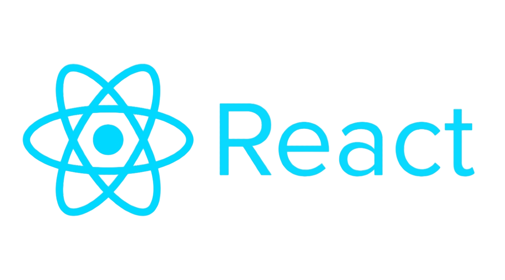
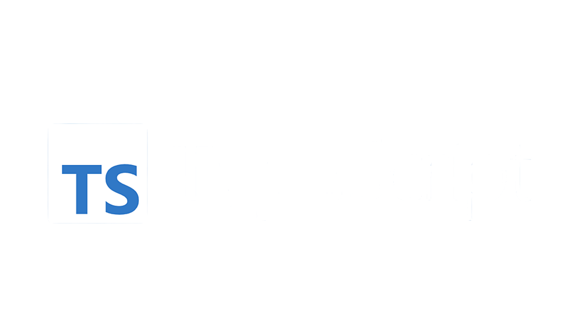
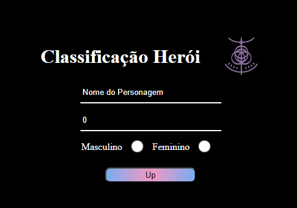
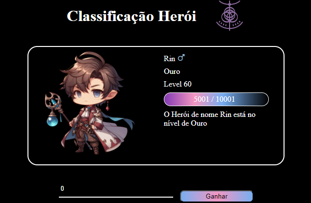
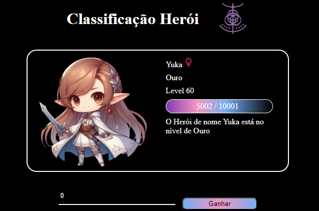

# ⚜️Desafio Santander Bootcamp 2024 - Classificador de Nível de Herói ⚜️
Primeiro desafio proposto pelo Bootcamp da Santander na trilha de *Desenvolvimento de Jogos com Godot* elaborado em Web com **Typescript** e **React**.

 

Inicialmente deve-se informar o nome do seu Herói, a quantidade de experiência que possui e o sexo do personagem. 
Poder ser acessado através desse [Link](https://classificador-nivel-heroi.vercel.app/)

 

### Desafio 🚀
**O Que deve ser utilizado**
- Variáveis
- Operadores
- Laços de repetição
- Estruturas de decisões

**Objetivo**

Crie uma variável para armazenar o nome e a quantidade de experiência (XP) de um herói, depois utilize uma estrutura de decisão para apresentar alguma das mensagens abaixo:

- Se XP for menor do que 1.000 = Ferro
- Se XP for entre 1.001 e 2.000 = Bronze
- Se XP for entre 2.001 e 5.000 = Prata
- Se XP for entre 5.001 e 7.000 = Ouro
- Se XP for entre 7.001 e 8.000 = Platina
- Se XP for entre 8.001 e 9.000 = Ascendente
- Se XP for entre 9.001 e 10.000= Imortal
- Se XP for maior ou igual a 10.001 = Radiante

**Saída**

Ao final deve se exibir uma mensagem:
*"O Herói de nome **{nome}** está no nível de **{nivel}**"*

